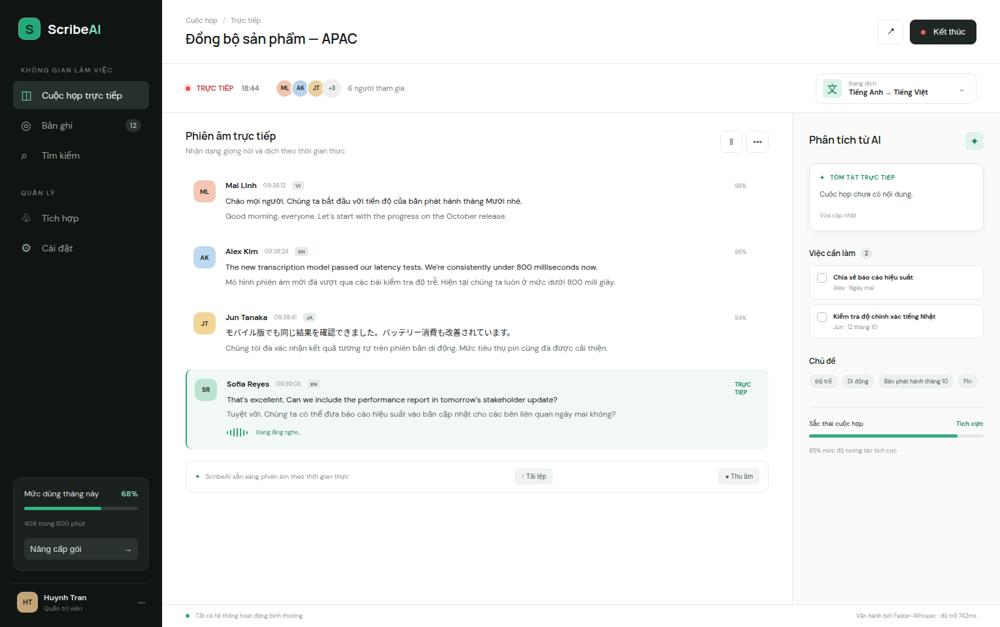

# ScribeAI

Distributed AI meeting assistant for real-time multilingual transcription and translation. The current MVP provides a working FastAPI/WebSocket ingestion API, a polished live meeting dashboard, and a headless Playwright meeting agent scaffold.



## What works

- Create and manage live meeting sessions through a typed REST API.
- Ingest speaker-attributed transcript segments and broadcast them over WebSockets.
- Monitor a multilingual live transcript with translations, confidence, summary, tasks, topics, and sentiment.
- Launch a zero-shot Google Meet bot using TypeScript and Playwright (subject to the meeting host admitting it).
- Run the service stack with FastAPI, Redis, and PostgreSQL through Docker Compose.

## Quick start

Requires Python 3.11+.

```bash
python -m venv .venv
.venv/bin/pip install -r requirements.txt
.venv/bin/uvicorn app.main:app --reload
```

Open [http://localhost:8000](http://localhost:8000). API documentation is at `/docs` and health status at `/api/health`.

Run tests:

```bash
.venv/bin/pytest -q
```

Or launch the infrastructure:

```bash
docker compose up --build
```

## Meeting bot

```bash
cd bot-agent
npm install
npx playwright install chromium
MEETING_URL="https://meet.google.com/..." npm start
```

The agent joins muted with the name `ScribeAI Notes`. Google Meet UI selectors can change, so validate the bot against your Workspace policy before production use.

## Architecture

```text
Meeting ──> Playwright agent ──> Audio/segment workers
                                      │
                                      ▼
Dashboard <── WebSocket/API <── Redis Streams
                    │
                    └──────────> PostgreSQL
```

The MVP uses an in-process repository for a zero-config demo. `docker-compose.yml` provisions Redis Streams and PostgreSQL as the production integration boundary. Faster-Whisper/CUDA workers can publish normalized `TranscriptSegment` events to `POST /api/meetings/{id}/segments` while the API fans them out to connected clients.

## API example

```bash
curl -X POST http://localhost:8000/api/meetings \
  -H 'content-type: application/json' \
  -d '{"title":"Weekly sync","source_language":"auto","target_language":"vi"}'
```

## Roadmap

- Faster-Whisper GPU worker and voice activity detection
- Durable Redis consumer groups and PostgreSQL repositories
- Zoom and Microsoft Teams meeting adapters
- Authentication, tenant isolation, and encrypted recordings

MIT licensed. See [LICENSE](LICENSE).
